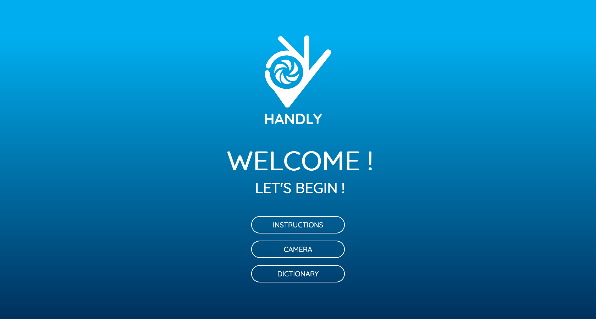
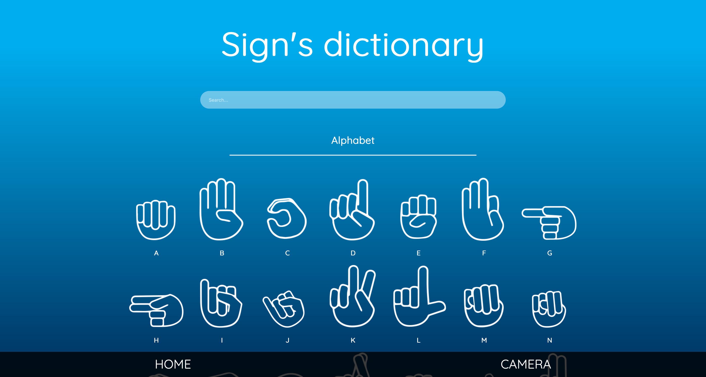

# WireHack-Handly

Project for the WireHack 2019.
First price and price of the better presentation.

## What?
An app that allow hard to heard and muted people to communicate with others without force them to learn sygn's language.

## Screenshot

## Target?
- Hard to heard people
- Muted people
- Fammily of them
- Public instututions (administration, school,...)

## How?
With a sygn's dictionary and a live tranlator.

## Why?
To make their life better and make a lucrative business.

## Who?
* [Maxim Berge](https://www.linkedin.com/in/maxim-berge-94b486179/) -> Project manager + front-end code + Presentation
* [Cassandra Caestecker](https://www.linkedin.com/in/cassandra-caestecker/) -> Design + Mockup + front-end code
* [Amaury Dotrice](https://www.linkedin.com/in/amaurydotrice/) -> Front-end code
* [Adrien Godaert](https://www.linkedin.com/in/adriengodaert/) -> Front-end code
